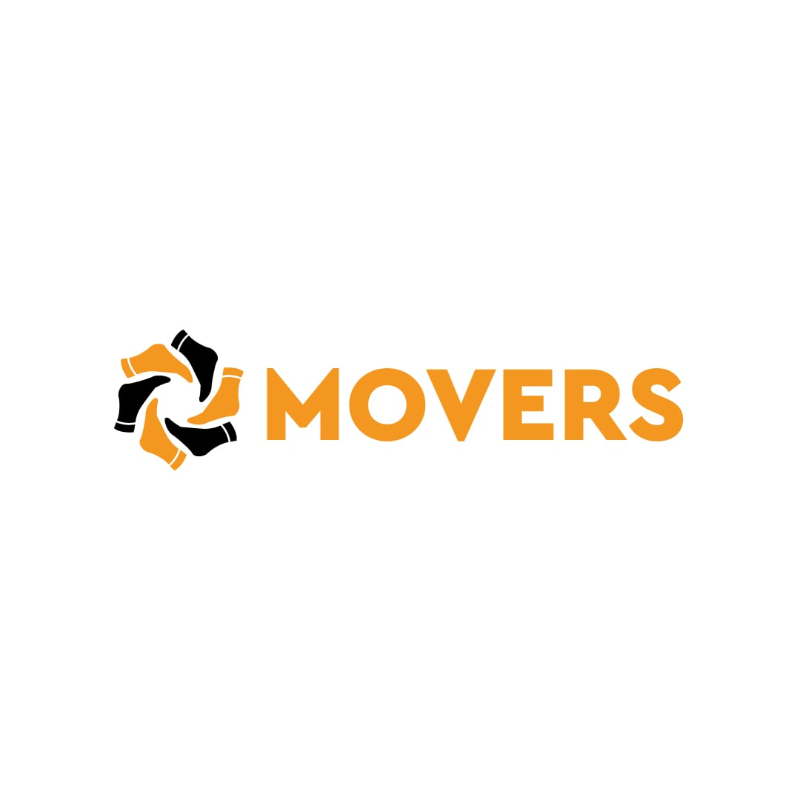

# Movsers-conversation
<link rel="stylesheet" href="style.css">
 <h1>Здесь вы можете узнать больше о нас</h1>

<!-- <h3>В youtube мы выкладываем встречи команды и видео уроки</h3> -->
 
 <!-- <h3>В notion мы загружаем все задачи</h3> -->

<!-- <h3>В instagram вы можете посмотреть новости нашей команды</h3> -->

